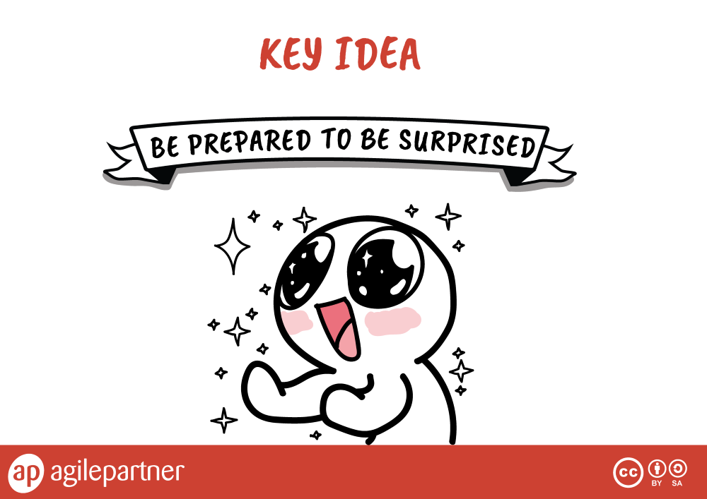

# Open Space Technology

*"Open Space Technology (OST) is **a method for organizing and running a meeting or multi-day conference**, where participants have been invited in order to focus on a specific, important task or purpose. OST is a participant-driven process whose agenda is created by people attending. At the end of each OST meeting, a document is created summarizing the work of the group. The OST method is based upon work, beginning in the 1980s, by Owen Harrison. It was one of the top ten organization development tools cited between 2004 and 2013."* - [Wikipedia](https://en.wikipedia.org/wiki/Open_Space_Technology)

## A participant driven process
* Agenda and organization is created by people attending
* People have been invited
* The purpose is to focus on
    * Specific / important task
	* Or purpose

## What do you need to organize an Open Space ?
* A Theme : a powerful one than can inspire participation
* A group : of people interested and committed to the them
* A space
* A time slot

## 4 principles

## 2 totem animals

## 1 law

## 1 key idea

You can download those infographics [here](images/open-space-technology.pdf).

# Usage example
## [#PLAY14](https://play14.org/)
#play14 is an international gathering of like-minded people who share the common idea that playing is the best way to learn and understand !

> It is an unconference, where all attendees are also contributors.  
People with many different profiles and experiences are invited **to share serious games & fun activities, experiences & tips, knowledge & insights, laughts & smiles. Everyone is welcome to join.**

 All you need to do is show up, and you will be given the opportunity to **propose some games, or play the games proposed by the others**.

## Resources
* [Debriefing cube - *How to debrief a serious game ?*](http://www.kilearning.net/TheDebriefingCube_CC-BY_v13.pdf) 

* [Open space infographics](images/open-space-technology.pdf)

## Our cheat sheet
